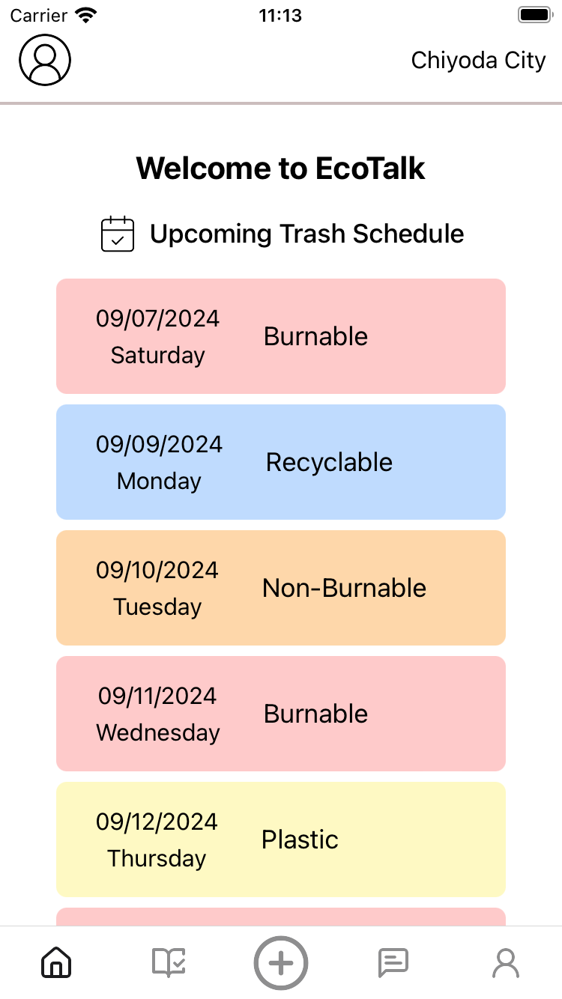
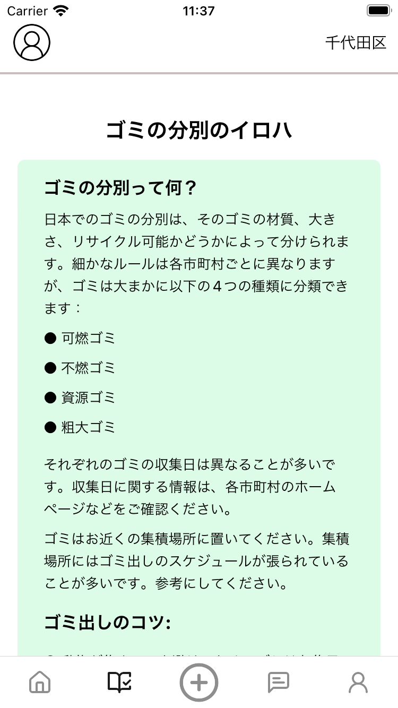
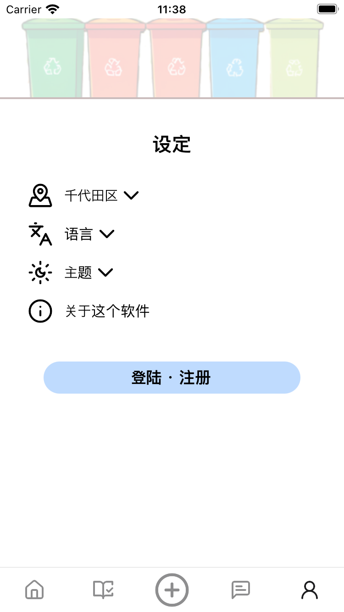

# EcoTalk

EcoTalk is a React Native application designed to provide information needed for understanding trash sorting in Japan. The app features a calendar to keep track of trash schedules, along with a discussion board to share information with others.

## Features

- **Trash schedule calendar:** Keep track of the trash schedule of your area
- **Discussion board:** Post information about your city
- **Multilingual support:** Support for Japanese, English, Simplified Chinese

## Screenshots

| Trash Schedule Calendar                          | Guides                                       | Settings                                         |
|--------------------------------------------------|----------------------------------------------|--------------------------------------------------|
|  |  |  |

## Prerequisites

- **Node.js:** Version 20
- **Yarn:** Version 1.22.22
- **Android Emulator** or **iOS Simulator**
- **Docker**: Required for running Supabase backend
- **[Supabase CLI](https://supabase.com/docs/guides/cli/getting-started)**

## Installation

1. **Clone the repository:**

   ```sh
   git clone https://github.com/Kooki1000/eco-talk.git
   cd eco-talk
   ```

2. **Install dependencies:**

   ```sh
   yarn install
   ```

## Running the App

### Start Supabase local environment

  ```sh
  supabase start
  ```

Refer to [Supabase documentation](https://supabase.com/docs/guides/cli/local-development) for more information.

### Add .env file

After running the Supabase environment, create a `.env` file in the root directory of your project. You can use the `.env.example` file as a reference.

  ```sh
  cp .env.example .env
  ```

### On Android

   ```sh
   yarn run android
   ```

### On iOS

  ```sh
  yarn run ios
  ```

### Warning

When running the app locally, please note that there is no data present by default. You will need to populate the database with sample data or your own data to fully test the app's features.

## Contributing

Contributions are welcome! Please fork the repository and submit a pull request.

1. **Fork the repository**
2. **Create a new branch (`git checkout -b feature-branch`)**
3. **Commit your changes (`git commit -am 'Add new feature'`)**
4. **Push to the branch (`git push origin feature-branch`)**
5. **Create a new pull request**

## License

This project is licensed under the MIT License.
